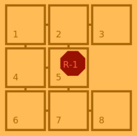

# Distances and Paths

Efficient _MoveIt_ AI requires evaluation of distance in graph and path computation.
In this tutorial we consider only on robot on the map.

## Distance with Disjkstra

Let consider a graph, [Dijkstra's algorithm](https://en.wikipedia.org/wiki/Dijkstra%27s_algorithm) compute the shortest path from a given origin node toward a destination node.
Starting from the origin node, _Dijkstra_ visits all possible connections, in a recursive way, until the destination node is founded.

By considering that, the destination node would be the last visited one, Dijkstra computes a distances' dictionary from the origin node toward all the other nodes.  
In _MoveIt_ game, the algorithm can be simplified considering that all weight is $1$.
Furthermore, `nodes` are similar to `tiles` in our model.

Let consider a simple graph of $8$ nodes:



Starting from node $5$, _Simplified-Dijkstra_ will first find $2$, $4$ and $7$ at distance $1$, then $1$, $3$, $6$ and $8$ at distance 2.
The algorithm deep into the graph until all nodes are visited, ring by ring.

```python
    def computeDistances(self, iTile):
        # Initialize distances to 0:
        dists= [iTile] +  [0 for i in range( self._model.map().size() )]
        # Initialize step from iTile:
        ringNodes= self._model.map().neighbours(iTile)
        ringDistance= 1
        # while theire is nodes to visit
        while len(ringNodes) > 0 :
            nextNodes= []
            # Visit all step nodes:
            for node in ringNodes :
                # Update distance information
                dists[node]= ringDistance
            for node in ringNodes :
                # Search for new tile to visit:
                neighbours= self._model.map().neighbours(node)
                for candidate in neighbours :
                    if dists[candidate] == 0 :
                         nextNodes.append(candidate)
            # swith to the next step.
            ringNodes= nextNodes
            ringDistance+= 1
        # Correct 0 distance:
        dists[iTile]= 0
        return dists
```

At this point, we compute the distances considering one origin node.
The idea is to apply this method to all nodes, at the start time (into the `wakeUp` method) to fill an entire matrix.

x  | 1 | 2 | 3 | 4 | 5 | 6 | 7 | 8 |
---|---|---|---|---|---|---|---|---|
1: |   |   
2: |   |   
3: |   |   
4: |   |   
5: | 2 | 1 | 2 | 1 | 0 | 2 | 1 | 2 | 
6: |   |   
7: |   |   
8: |   |   

## Path Planning

So it is possible to consider that we have a distance matrix structure over all couple of nodes (named `_distances`).
From that statement, going from a tile _A_ to a tile _B_ consists in moving step by step, by selecting the next node with the minimal distance to _B_.

**1:** _**moveToward**_ selects the next appropriate move.

```python
    def moveToward(self, iTile, iTarget):
        # If no need to move:
        if iTile == iTarget :
            return 0, iTile
        # Get candidates:
        clockdirs= self._model.map().clockBearing(iTile)
        nextTiles= self._model.map().neighbours(iTile)
        selectedDir= clockdirs[0]
        selectedNext= nextTiles[0]
        # Test all candidates:
        for clock, tile in zip( clockdirs, nextTiles ) :
            if self._distances[tile][iTarget] < self._distances[selectedNext][iTarget] :
                selectedDir= clock
                selectedNext= tile
        # Return the selected candidates:
        return selectedDir, selectedNext
```

**2:** Then, _**path**_ calls _**moveToward**_ until the position is reached.

```python
    def path(self, iTile, iTarget):
        clock, tile= self.moveToward(iTile, iTarget)
        move= [clock]
        path= [tile]
        while tile != iTarget :
            clock, tile= self.moveToward(tile, iTarget)
            move.append( clock )
            path.append( tile )
        return move, path
```

From that point it is now possible to orient robot moves toward the next mission to take or toward the current mission target.

## A* algorithm

In _A* family algorithms_, we consider that we do not have an exact distance matrix, and that it requires too much computation to create it.
However, it is considered true that it is possible to have approximate distances, typically, Euclidean distances computed from tile centers.
The approximate distance is considered as an heuristic to guide the path planning.

At each time step, the next node is selected accordingly to the heuristic (the closest one to the target), but backtrack mechanism is added if the search fall in a deadlock.

More detail on [wikipedia](https://en.wikipedia.org/wiki/A*_search_algorithm).
