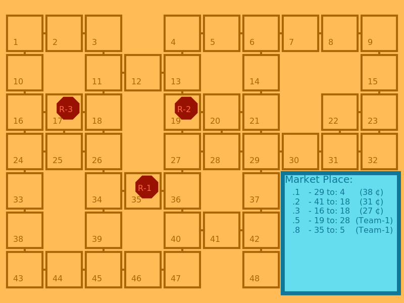

# Régles du jeux

_MoveIt_ consiste donc à déplacer des robots dans une carte pour réalisér des missions.
Un randu visuel est proposé à l'aide de la librairie graphique [Cairo](https://www.cairographics.org/).

Ci apprés une capture d'écrant du jeux: 



On peu y voir 3 robots rouges (`R-1`, `R-2` et `R-3`) pouvant se déplacer sur un graphe composé de 48 cellules/dalles (_tiles_ en anglais)
Un Market-Place propose des missions à réaliser par les robots.

## Jouer: 

Nous supposons ici que vous avais clonez _MoveIt_ et que vous l'avez installé sur votre machine.
Le répertoire `play` contiend un certaint nombre de scripts ($2$ pour l'instant), permetant de lancer _MoveIT_ dans différente configuration dans un mode interactif. Vous, humain, jouez au jeu en envoyant vos commands dans le terminal.

Lancer le jeu dans son mode le plus basic:

```sh
python3 ./game-moveit/play/debug.py
```

Une représentation du jeux est mise à jour à chaque pas-de-temps dans `./shot-moveIt.png` pour avoir une idée de l'état du jeu est prendre les bonnes décisions.

Les décisions consernent en premier lieu les déplacement des robots et se code de la paçon suivante: `move iRobot direction`.
Chaque robot donc est identifié par un numéro de $1$ à $n$ avec $n$ robots.
La direction est codé sur une logique horaire ([Clock Bearing](https://en.wikipedia.org/wiki/Clock_position)). Le robot peut se dépacer à midi, 3 heure, 6 heure ou 9 heure. 

Par exemple avec trois robots:

```sh
move 1 9 2 12 3 3
```

Cet commande indique que le robot-1 bouge dans la direction 9H, le robot-2 vers 12h et le robot-3 vers 3H. Une direction $0h$ indiquera que le rbots reste sur sa position (action par défault).

Les robots peuvent réaliser une mission, soit pour la débuter, soit pour la finaliser. Dans ce cadre, le robot doit être sur la bonne possition pour faire une action mission : `mission iRobot iMission`. `iMission` est l'identifiant de la mission à activer ou a finaliser entre $1$ et $m$ avec $m$ missions sur le jeu.
L'example suivant indique que le robot-2 active la mission `8`. 

```sh
mission 2 8
```

à noter que $2$ mission ne raporteront pas néccéssairement le même nombre de crédit (¢).
L'équipe de robot à un nombre de tours (tic) limité pour réaliser un maximun de mission.
Aussi, il est préférable de faire les actions missions en même temps que des déplacements des autres robots, par exemple: 

```sh
mission 2 8 move 1 0 3 12
```

Pour un version plus riche du jeu: 

```sh
python3 ./game-moveit/play/moveIt.py
```

## Version multi-joueur


